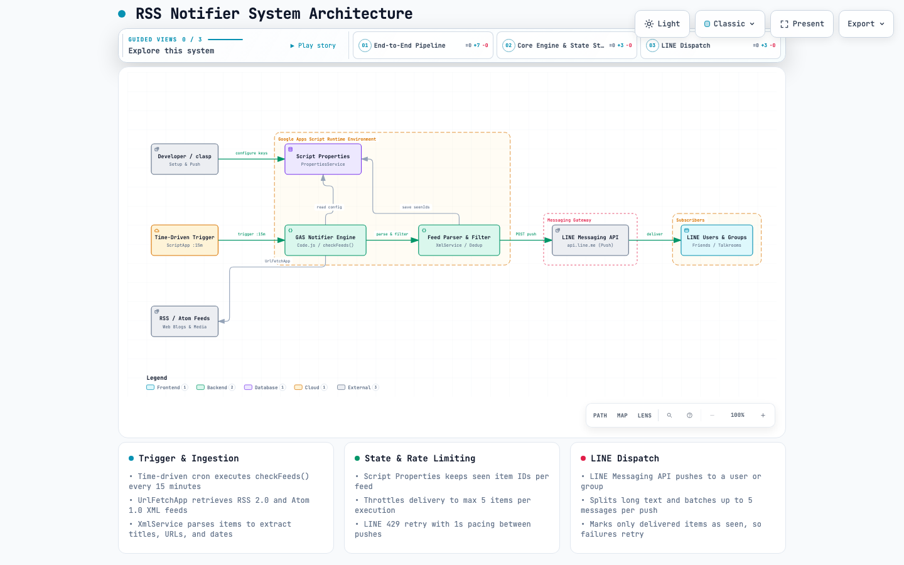

# rss-notifier

[English](README.md) | [日本語 (Japanese)](README.ja.md)

RSS/Atom フィードの更新を検出して LINE に通知する Google Apps Script (GAS) プロジェクトです。

## 機能

- 複数の RSS/Atom フィードを定期ポーリング
- 新着記事を LINE Messaging API で通知
- 1 回の実行あたりの通知件数を制限（スパム防止）
- 既読管理を Script Properties に保存（再起動後も状態を維持）

## システム構成

[](https://hidenobunagai.github.io/rss-notifier/)

> 🔗 **インタラクティブ構成図（Live Preview）**: [https://hidenobunagai.github.io/rss-notifier/](https://hidenobunagai.github.io/rss-notifier/)
> ブラウザで開くことで、ライト/ダークテーマ切替、ガイド付きステップビュー（全体フロー / GAS内部処理 / 通知ゲートウェイ）、各ノードのハイライトや依存関係の追跡が可能です。

## セットアップ

### 1. clasp でプッシュ

```bash
bun add -g @google/clasp
clasp login
clasp push
```

### 2. Script Properties を設定

GAS エディタのスクリプトエディタで以下の関数を**順に**実行します。

```javascript
// --- LINE ---
// LINE Messaging API のチャネルアクセストークンを登録
setLineChannelAccessToken("YOUR_LINE_CHANNEL_ACCESS_TOKEN");
// LINE の送信先 ID (ユーザー/グループ/トークルーム) を登録
setLineTargetId("YOUR_LINE_TARGET_ID");

// --- 共通 ---
// 監視するフィード URL を登録
setFeedUrls(["https://example.com/feed", "https://blog.example.jp/rss"]);

// 既存記事を既読としてマーク（初回通知をスキップ）
markCurrentAsRead();
```

> 通知先の有効条件:
>
> - LINE: `lineChannelAccessToken` と `lineTargetId` が両方設定されていれば送信
> - 未設定の場合はエラーで中断します。先に設定してください。

### 3. 定期トリガーを作成

```javascript
createTimeTrigger(); // 15 分ごとに checkFeeds() を実行
```

## 定数（Code.js）

| 定数                         | デフォルト       | 説明                                      |
| ---------------------------- | ---------------- | ----------------------------------------- |
| `MAX_NOTIFICATIONS_PER_RUN`  | `5`              | 1 実行あたりの最大通知件数                |
| `LINE_MAX_TEXT_LENGTH`       | `5000`           | LINE 1 メッセージあたりの文字数上限       |
| `LINE_MAX_MESSAGES_PER_PUSH` | `5`              | LINE 1 push あたりのメッセージ数上限      |
| `LINE_CHUNK_INTERVAL_MS`     | `1000`           | LINE push 間の待機時間 ms（レート制限）   |
| `LINE_MAX_RETRIES`           | `3`              | LINE 送信の最大リトライ回数               |

## 管理コマンド

| 関数                               | 説明                                                   |
| ---------------------------------- | ------------------------------------------------------ |
| `setLineChannelAccessToken(token)` | LINE チャネルアクセストークンを登録                    |
| `setLineTargetId(id)`              | LINE 送信先 ID (ユーザー/グループ/トークルーム) を登録 |
| `setFeedUrls(urls)`                | 監視フィード URL 一覧を設定                            |
| `markCurrentAsRead()`              | 現在の最新記事を既読としてマーク                       |
| `createTimeTrigger()`              | 15 分おきのトリガーを作成                              |
| `deleteTimeTrigger()`              | トリガーを削除（停止）                                 |
| `checkFeeds()`                     | 手動でフィードをチェック                               |

## LINE Messaging API のセットアップ

> **注意**: 旧来の LINE Notify は 2025/3 に廃止されたため、本プロジェクトでは LINE Messaging API（公式アカウント経由の push メッセージ）を使用します。

1. [LINE Developers](https://developers.line.biz/) でプロバイダーと Messaging API チャネルを作成
2. チャネルの「Messaging API 設定」で「チャネルアクセストークン」を発行し、控える
3. 通知を受け取りたい LINE アカウント（自分自身や家族グループ）を公式アカウントと友だち追加
4. 送信先 ID を確認:
   - 個別ユーザー: 公式アカウントにメッセージを送って webhook で取得する `userId` など
   - グループ / トークルーム: 公式アカウントをグループに招待した後に同ページの「グループ / トークルーム ID」を参照
5. Apps Script で `setLineChannelAccessToken(...)` と `setLineTargetId(...)` を実行してプロパティ登録

### LINE の注意点

- 無料枠（Light Plan）では月 1,000 メッセージまで。超過分は従量課金または送信制限されるため、通知頻度に注意
- `push` API は友だち追加済みの相手にのみ届く。未追加ユーザーへの送信は失敗する
- グループ / トークルームへ送る場合は公式アカウントをその部屋に招待しておく
- アクセストークンは定期的にローテーション推奨（漏洩時は即時再発行）

## トラブルシュート

- **通知が来ない**: `lineChannelAccessToken` + `lineTargetId` が未設定ではないか確認。実行ログに `Notify error` が出ていないか確認
- **LINE 401 Unauthorized**: チャネルアクセストークンが不正または期限切れ。再発行して `setLineChannelAccessToken(...)` で更新
- **LINE 400 Bad Request**: `lineTargetId` が不正、または公式アカウントと友だち追加されていない。ID の種類（ユーザー / グループ / トークルーム）と友だち追加状態を確認
- **LINE で届かない（エラーなし）**: 無料枠の月 1,000 メッセージ上限に達していないか確認

## ファイル構成

```
.
├── Code.js              # メインスクリプト
├── appsscript.json      # GAS マニフェスト
├── LICENSE              # MIT ライセンス
├── docs/                # システム構成・可視化ドキュメント
│   ├── architecture.html # インタラクティブ構成図
│   ├── architecture.json # アーキテクチャ定義仕様
│   └── architecture.png  # アーキテクチャ図キャプチャ
├── test/                # ローカルテスト（`bun test`）
└── .claspignore         # `clasp push` の対象を GAS ファイルだけに絞る
```

> **注意**: `.clasp.json`（scriptId を含む）は `.gitignore` で除外しています。
> 新しい環境で作業する場合は `clasp clone <scriptId>` で再取得してください。

### `clasp push` の対象とローカルテスト

`.claspignore` は**許可リスト**方式です。まず全除外（`**/**`）し、リポジトリ直下の
`appsscript.json` / `*.gs` / `*.js` / `*.html` だけを `!` で戻しています。
拒否リスト（`docs/` や `test/` を列挙する形）にしていないのは、`.claspignore` を置くと
clasp の既定 ignore が**置き換わる**ためで、その形だと `node_modules/**/*.js` や
ルート直下のツール用 `*.js` が逆に push 対象へ入ってしまいます。

push 前に実際の対象を確認できます:

```bash
clasp status   # Tracked files: appsscript.json, Code.js
```

GAS 側にファイルを足すときは `.claspignore` に `!` の行を足してください
（足し忘れても `clasp status` の "Untracked files" に出るので気づけます）。

純関数（`safeParseDate` / `normalizeLineMessage` / チャンク分割 / 記事の選別）は、
GAS グローバルをスタブして `Code.js` を読み込む小さなハーネスで検証しています:

```bash
bun test
```
