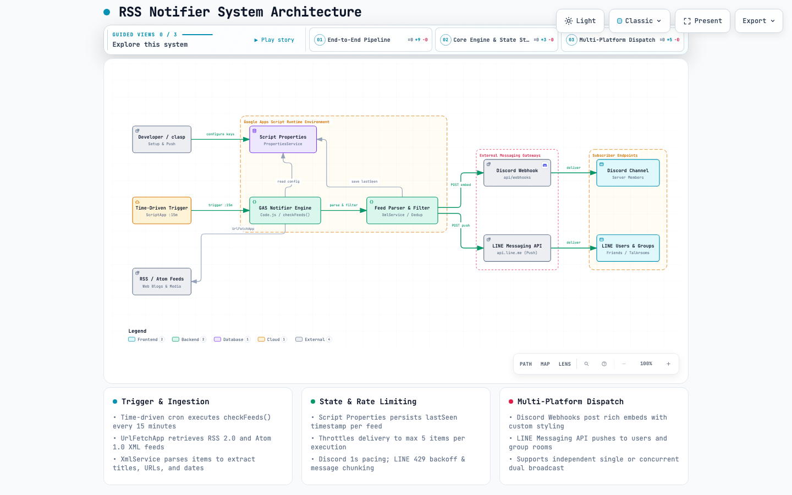

# rss-notifier

[](https://hidenobunagai.github.io/rss-notifier/)
[](https://developers.google.com/apps-script)
[](LICENSE)

[English](README.md) | [日本語 (Japanese)](README.ja.md)

A lightweight Google Apps Script (GAS) service that monitors RSS/Atom feeds and dispatches real-time notifications to **Discord** and **LINE**. Channels can be activated individually or simultaneously.

---

## ✨ Features

- **Multi-Feed Polling**: Periodically fetches and parses multiple RSS 2.0 and Atom 1.0 feeds.
- **Dual-Channel Notifications**: Delivers styled Discord Webhook embeds and LINE Messaging API push messages.
- **Independent Dispatch**: Enable Discord only, LINE only, or both concurrently.
- **Spam & Rate-Limit Protection**: Enforces maximum notifications per run (`MAX_NOTIFICATIONS_PER_RUN`), sleep intervals, and LINE 429 exponential backoff retries.
- **Persistent State**: Stores last-seen timestamps in `Script Properties` to prevent duplicate alerts across runs.
- **Zero Hosting Cost**: Runs completely serverless on Google Apps Script free quotas.

---

## 🏛️ System Architecture

[](https://hidenobunagai.github.io/rss-notifier/)

> 🔗 **Interactive Architecture Map (Live Preview)**: [https://hidenobunagai.github.io/rss-notifier/](https://hidenobunagai.github.io/rss-notifier/)  
> Open in your browser for light/dark theme toggles, guided walk-through chapters (Full Flow / GAS Internals / Dispatch Gateways), node inspection, and relationship tracing.

---

## 🚀 Getting Started

### 1. Push Code with clasp

Clone or download this repository, then push it to your Google Apps Script project:

```bash
bun add -g @google/clasp
clasp login
clasp push
```

### 2. Configure Script Properties

Open the Apps Script editor and run the following helper functions in order.
Configure Discord, LINE, or both depending on your target platforms:

```javascript
// --- For Discord ---
// Register your Discord Webhook URL
setWebhookUrl("https://discord.com/api/webhooks/YOUR_ID/YOUR_TOKEN");

// --- For LINE ---
// Register your LINE Messaging API Channel Access Token
setLineChannelAccessToken("YOUR_LINE_CHANNEL_ACCESS_TOKEN");
// Register the target User ID, Group ID, or Room ID
setLineTargetId("YOUR_LINE_TARGET_ID");

// --- Common Setup ---
// Register RSS / Atom feed URLs to monitor
setFeedUrls([
  "https://example.com/feed",
  "https://blog.example.com/rss.xml"
]);

// Mark existing articles as read (skips notifying past articles on initial run)
markCurrentAsRead();
```

> **Channel Activation Rules**:
> - **Discord**: Enabled if `discordWebhookUrl` is set.
> - **LINE**: Enabled if both `lineChannelAccessToken` and `lineTargetId` are set.
> - At least one destination must be configured.

### 3. Create Time-Driven Trigger

```javascript
createTimeTrigger(); // Creates a cron trigger running checkFeeds() every 15 minutes
```

---

## ⚙️ Configuration Constants (`Code.js`)

| Constant | Default | Description |
| :--- | :--- | :--- |
| `MAX_NOTIFICATIONS_PER_RUN` | `5` | Maximum notifications sent per execution (anti-spam) |
| `DISCORD_USERNAME` | `"RSS Notifier"` | Display username for Discord posts |
| `DISCORD_EMBED_COLOR` | `3447003` | Left border accent color for Discord embeds (`#3498DB` blue) |
| `NOTIFY_INTERVAL_MS` | `1000` | Delay between Discord posts in ms (rate-limit prevention) |
| `LINE_MAX_TEXT_LENGTH` | `5000` | Maximum character length per LINE message |
| `LINE_MAX_MESSAGES_PER_PUSH` | `5` | Maximum messages batched per LINE push call |
| `LINE_CHUNK_INTERVAL_MS` | `1000` | Delay between consecutive LINE push requests in ms |
| `LINE_MAX_RETRIES` | `3` | Maximum retry attempts for LINE API calls |

---

## 🛠️ Management Commands

| Function | Description |
| :--- | :--- |
| `setWebhookUrl(url)` | Save Discord Webhook URL to Script Properties |
| `setLineChannelAccessToken(token)` | Save LINE Channel Access Token to Script Properties |
| `setLineTargetId(id)` | Save LINE Target ID (User/Group/Room) to Script Properties |
| `setFeedUrls(urls)` | Save list of feed URLs to Script Properties |
| `markCurrentAsRead()` | Mark all current latest feed items as seen |
| `createTimeTrigger()` | Create 15-minute periodic trigger |
| `deleteTimeTrigger()` | Remove the periodic trigger (pause monitoring) |
| `checkFeeds()` | Manually trigger feed check and notification |
| `validateSetup()` | Verify configuration and return diagnostics |

---

## 📱 LINE Messaging API Setup Guide

> **Note**: Legacy LINE Notify was discontinued in March 2025. This project uses the official **LINE Messaging API** (push messages via Official Account).

1. Create a Provider and a Messaging API Channel on [LINE Developers](https://developers.line.biz/).
2. Issue a **Channel Access Token** under "Messaging API Settings".
3. Add the Official Account as a friend (or invite it to your target Group).
4. Retrieve the target ID:
   - **User ID**: From the developer console or Webhook events.
   - **Group ID**: From group invite webhook events or console settings.
5. In Apps Script, execute `setLineChannelAccessToken(...)` and `setLineTargetId(...)`.

### LINE Quota Considerations
- The **Free Light Plan** includes 1,000 push messages/month.
- Push messages can only reach users/groups that have added the bot as a friend.

---

## 🔍 Troubleshooting

- **No notifications sent**: Ensure `discordWebhookUrl` or both `lineChannelAccessToken` + `lineTargetId` are configured. Run `validateSetup()` to diagnose.
- **Discord 429**: Rate-limited by Discord. Check `NOTIFY_INTERVAL_MS` or reduce execution frequency.
- **LINE 401 Unauthorized**: Token is invalid or expired. Re-issue and update via `setLineChannelAccessToken(...)`.
- **LINE 400 Bad Request**: Invalid target ID or bot is not a member of the group/friend list.
- **LINE silent failure**: Free tier 1,000 monthly push message limit might be exhausted.

---

## 📁 Repository Structure

```
.
├── Code.js              # Main GAS application script
├── appsscript.json      # Google Apps Script manifest
├── README.md            # English documentation
├── README.ja.md         # Japanese documentation
├── docs/                # Architecture and visualization assets
│   ├── index.html       # GitHub Pages live root
│   ├── architecture.html# Interactive architecture diagram
│   ├── architecture.json# Archify specification schema
│   └── architecture.png # Static diagram capture
└── .gitignore           # Git ignore rules (.clasp.json, etc.)
```
